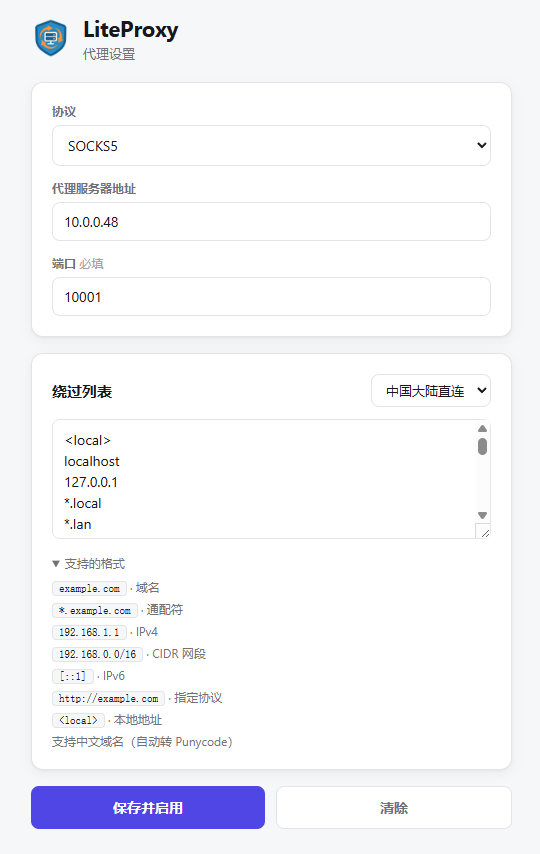

  

<h1 align="center">LiteProxy</h1>

  为 Chrome 而生的全局代理 轻量 · 克制 · 小而美

  
  
  
  

---

> 基于 Manifest V3 的 Chrome 全局代理扩展。没有账号、没有后端、没有追踪——装上即用，所有配置只存在你本地的浏览器里。它只做一件事：**把 Chrome 的流量导向你指定的代理服务器，并做到足够精致**。

## ✨ 功能

**核心**

- **即时切换** — 一键启用 / 禁用，立即生效
- **快捷键** — 在 `chrome://extensions/shortcuts` 自行绑定组合键切换
- **全协议** — HTTP / HTTPS / SOCKS4 / SOCKS5 / QUIC

**绕过规则**

- **右键绕过** — 任意网页 / 链接上右键，一键加入绕过列表
- **内置中国直连** — 常见国内域名与 IP 段自动直连，海外流量走代理
- **精确格式校验** — 域名、通配符、CIDR、IPv6、Punycode 全支持

**体验**

- **轻量无依赖** — 原生 JS，无构建步骤，全项目不到 600 行
- **错误提醒** — 代理连接异常时弹通知
- **最小权限** — 无任何网络请求权限，不收集任何数据

## 📦 安装

1. 下载或克隆本仓库
2. 地址栏打开 `chrome://extensions/`
3. 右上角开启 **开发者模式**
4. 点击 **「加载已解压的扩展程序」**，选择仓库根目录
5. 工具栏点 LiteProxy 图标 → 填写代理 → 保存

## 📖 使用

| 操作 | 方式 |
| :--- | :--- |
| 设置代理 | 扩展菜单 → 代理设置 |
| 开关切换 | 弹窗主按钮，或自行绑定的快捷键 |
| 加入绕过 | 网页 / 链接上右键 →「将此网站加入代理绕过列表」 |
| 加载预设 | 代理设置 → 预设规则 →「中国大陆直连」 |

### 绕过列表格式

每行一条：

| 格式 | 示例 | 说明 |
| :--- | :--- | :--- |
| 域名 | `example.com` | 仅精确匹配自身 |
| 通配符 | `*.example.com` | 匹配自身及所有子域 |
| IPv4 | `192.168.1.1` | — |
| CIDR 网段 | `192.168.0.0/16` | — |
| IPv6 | `[::1]` | 需方括号 |
| 指定协议 | `http://example.com` | — |
| 本地地址 | `<local>` | 内网 / 回环 |

> ⚠️ `example.com` **不会**自动匹配 `www.example.com`，要含子域请用 `*.example.com`。绕过列表中的地址走**直连**，既不走本扩展代理，也不走系统代理。

## 🔐 权限

LiteProxy 遵循最小权限原则：

| 权限 | 用途 |
| :--- | :--- |
| `proxy` | 设置 Chrome 代理 |
| `storage` | 保存配置（仅本地） |
| `contextMenus` | 右键菜单 |
| `notifications` | 状态通知 |

无任何 host / 网络权限，不上传任何数据。

## 🖼️ 界面预览

  

## 📄 许可

[MIT](LICENSE) · 用克制打造
